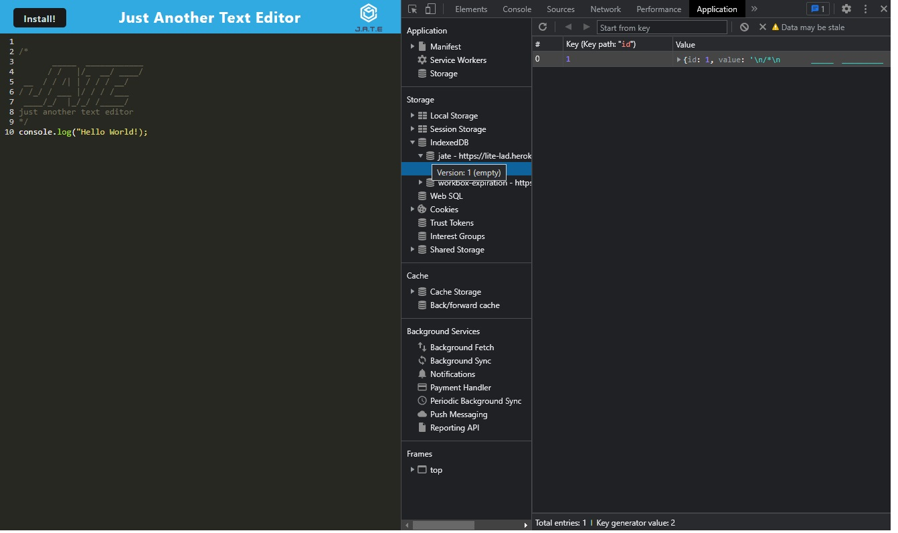
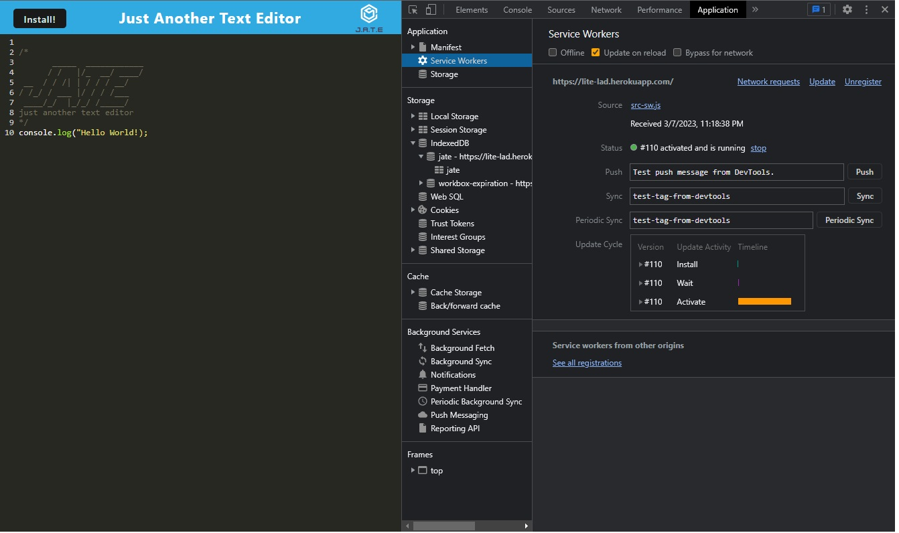
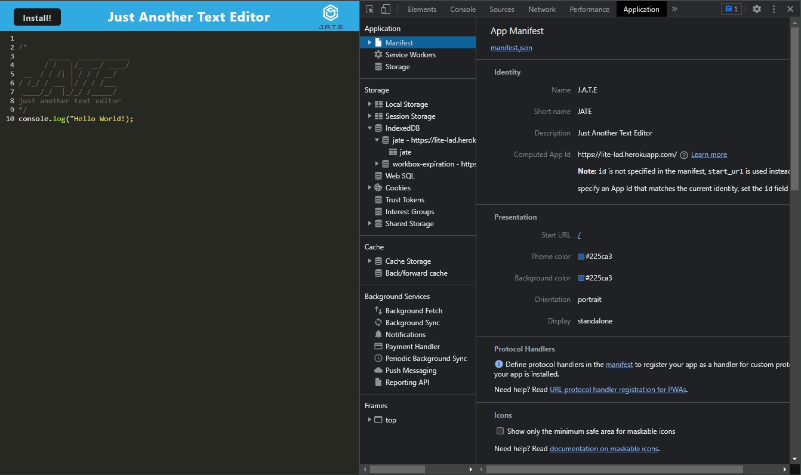
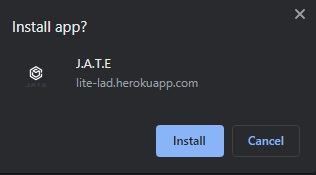
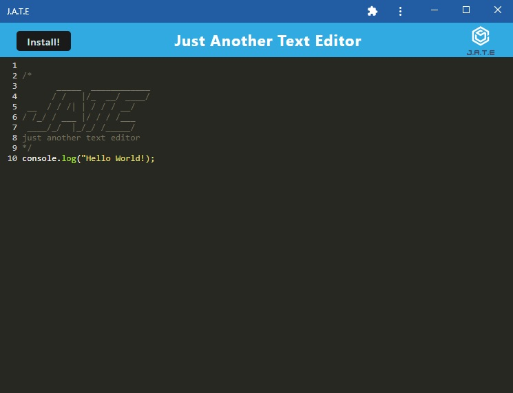

# L.I.T.E (Lydia's Installable Text Editor)

  ## Description
This application demonstrates a text editor PWA(Progressive Web Application) running in the browser with JavaScript. It has various types of redundancies to persist the data and allow it to run offline. 
 
  ## License
  
  [](https://opensource.org/licenses/MIT)
  
  ## Table of Contents
  
  - [Installation](#installation)
  - [Usage](#usage)
  - [License](#license)
  - [Contributing](#contributing)
  - [Questions](#questions)
  
  ## Installation
  
  Clone this repository to your GitHub account and install the dependencies using 
  ```
  npm install
  ```
  and run application from localhost using 
  ```
  npm run start
  ```
  Also make sure the idb package is installed, it's a wrapper around IndexedDb API calls to help store data.
  
  ## Usage

  https://lite-lad.herokuapp.com/

  You can visit the deployed application to and follow along with the walkthrough.

  When you click off the text window the data will be saved in IndexedDb in local storage. 
  

  This is the service worker that allows the website to load whether or not there is internet access. You can test this by checking the 'Offline' box under Service Workers.
  

  Here you can see the Manifest information that allows this application to be installed to the homescreen without the need of an app store. 
  

  When you click install an alert box will show asking if you would like to install.
  
 
  After installation the application changes to the window below.
  
  ## Contributing
  
  No contribution to this repo
   
  ## Questions
  
  Any questions please contact me at: ladudrey@gmail.com. 
  More examples of my work are available at [GitHub](https://github.com/LDudrey).